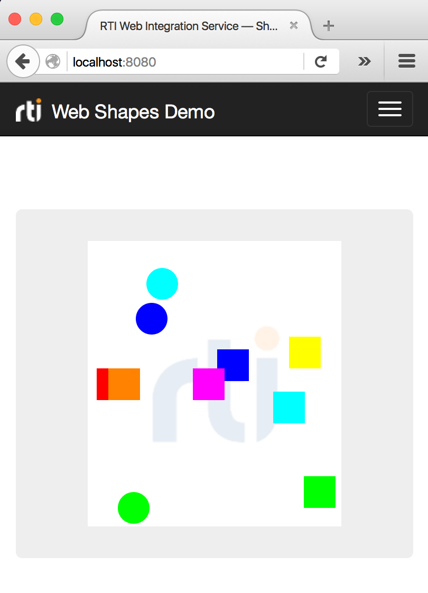

# Web Shapes Demo
This example illustrates how to subscribe to Shape topics using _RTI Web
Integration Service_. The samples read are drawn on a Canvas using Fabric—a
simple JavaScript framework.



## Running the Example
To run the example, open a terminal and enter the following command:

```
<NDDSHOME>/bin/rtiwebintegrationservice \
  -cfgFile /path/to/simple_shapes_demo/simple_shapes_demo_config.xml
  -cfgName SimpleShapesDemo
  -documentRoot /path/to/simple_shapes_demo
```

Where:

* The ```-cfgFile``` option adds loads the appropriate configuration file
into _Web Integration Service_.
* The ```-cfgName``` option specifies the configuration to be instantiated—in
this case ```SimpleShapesDemo```—which starts
the ```SimpleShapesDemoApplication```.
This application instantiates a _DomainParticipant_ with _DataReaders_ to read
to all shape topics (i.e., Squares, Circles, and Triangles).
* The ```-documentRoot``` argument specifies the folder that _Web
Integration Services_ web server will provide when accessing the default URL.
That is ```http://<hostname>:8080```.

Once you have started _Web Integration Service_, you can open _RTI Shapes
Demo_ and start publishing shapes. Open a browser and navigate
to ```http://<hostname>:8080```. You will find there all the shapes that
are being published.

